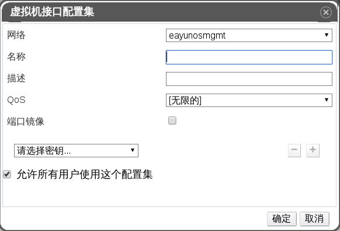

# 创建或编辑一个虚拟网卡配置集

**概述** 
创建或编辑一个虚拟网络接口控制器（VNIC）配置集为用户和用户组提供了对网络流量带宽的控制。
 
>**注意**
>
>如果您正在启用或禁用端口镜像，在编辑配置集前，和这个配置集相关联的虚拟机必须处于停机的状态。

 
**创建或编辑 VNIC 配置集**

1. 使用**网络**资源标签、树形面板或者检索功能在结果窗格中选择一个逻辑网络。

2. 在详情面板中选择**vNIC 配置集**子标签以显示可用的虚拟网卡配置集。如果您是通过树形面板选择的逻辑网络，您也可以在结果列表中选择
**vNIC 配置集** 标签。

3. 点击**新建**或**编辑**按钮来打开**虚拟机接口配置集**窗口。

   

   **虚拟机接口配置集窗口**

4. 输入该配置集的**名称**和**描述**。

5. 使用 **QoS** 下拉菜单选择将要应用到该 vNIC 配置集中的相应 QoS 策略。

6. 使用**端口镜像**复选框和**允许所有用户使用这个配置集**复选框来切换这些选项，从而实现其关闭或者开启。

7. 使用自定义属性下拉菜单（其默认显示为**请选关键字...**），来选择一个自定义属性并使用 **+** 和 **-** 按钮来添加额外的自定义属性或者删除已存在的自定义属性。

8. 点击**确定**保存该虚拟网卡配置集并关闭该窗口。

**结果** 
您已成功创建了一个虚拟网卡配置集。将该配置集应用到用户或者用户组上以控制他们所使用的网络带宽。
